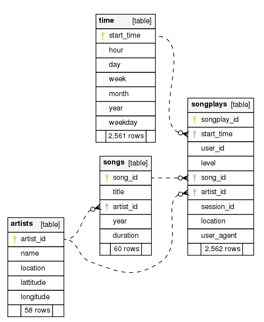
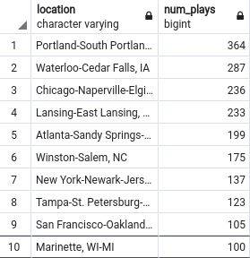
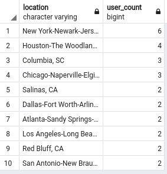

Udacity Project Submission: Data Modeling with Postgres
=======

Submission for Data Modeling with Postgres project.


- [Link to rubric](https://review.udacity.com/#!/rubrics/2500/view)
- [Link to project instructions](https://classroom.udacity.com/nanodegrees/nd027/parts/f7dbb125-87a2-4369-bb64-dc5c21bb668a/modules/c0e48224-f2d0-4bf5-ac02-3e1493e530fc/lessons/01995bb4-db30-4e01-bf38-ff11b631be0f/concepts/7a6e1e47-cb4f-4e98-be3f-02d71fbd82f6)

**Note:** Please rename the file `config.default.conf` to `config.conf` before running any other script.


## Introduction
The purpose of the database is to make it easier for the data science team at Sparkify to analyze their app's users' behaviors. Searching for particular song play event or a group of them can be done by running SQL queries to the final database.

## Schema Design

A complete schema of the database can be viewed from [db_schema/index.html](db_schema/relationships.html) document, generated by [SchemaSpy](http://schemaspy.org/).



List of datasets
- songplays: Log data of song plays.
- users: Users in the app.
- songs: Songs in the app's music database.
- artists: Artists in the app's music database.
- time: Timestamps of records in songplays.

## ETL Pipeline

1. Raw data from `song_data` directory are processed to fill `songs` and `artists` tables.
2. And similarly for `log_data` to extract data to be entered to `time` and `users` tables.
3. And finally, we fill `songplays` table with data gathered mainly from `log_data` with the addition of references to songs and artists.

## Example queries and results

What are the 10 most frequent song plays locations?


```
SELECT s.location, COUNT(*) num_plays
    FROM songplays s
GROUP BY location
ORDER BY num_plays DESC
LIMIT 10;
```

Result:



Which locations have the most number of users (10 best)?

```
SELECT s.location, COUNT(DISTINCT s.user_id) user_count
    FROM songplays s
GROUP BY location
ORDER BY user_count DESC
LIMIT 10;
```

Result:


